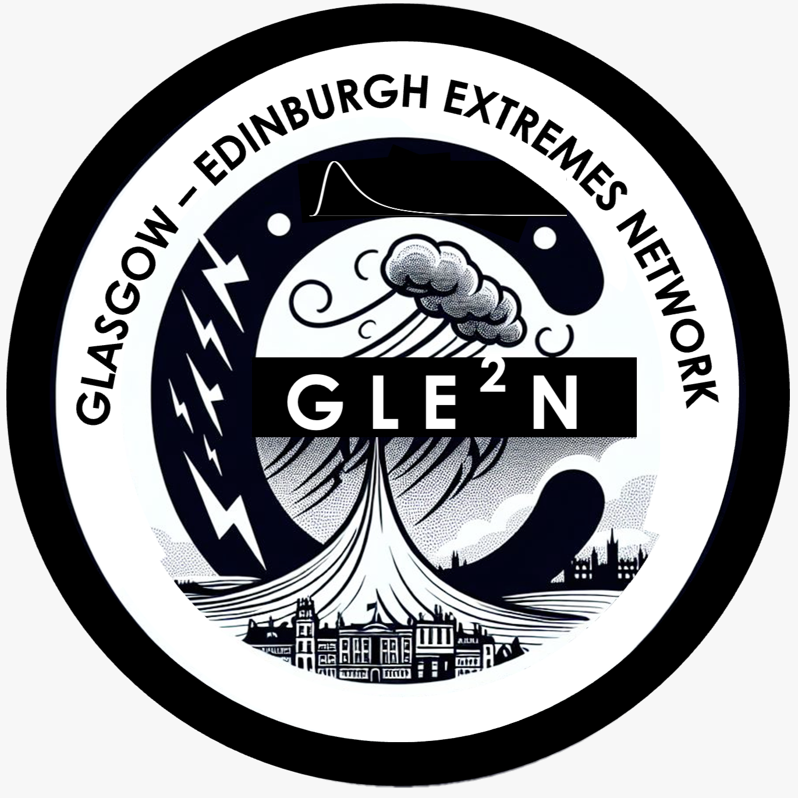

# GL(EN)2: The Glasgow–Lancaster-Edinburgh-Newcastle Extremes Network 🌊🌡️

GL(EN)2, formerly GLE2N, is a Northern UK collaboration that brings together researchers from the universities of Glasgow, Edinburgh, Heriot-Watt, Lancaster, and Newcastle to discuss applied, theoretical, and methodological contributions to statistical risk analysis and extreme value theory (EVT). 

  

