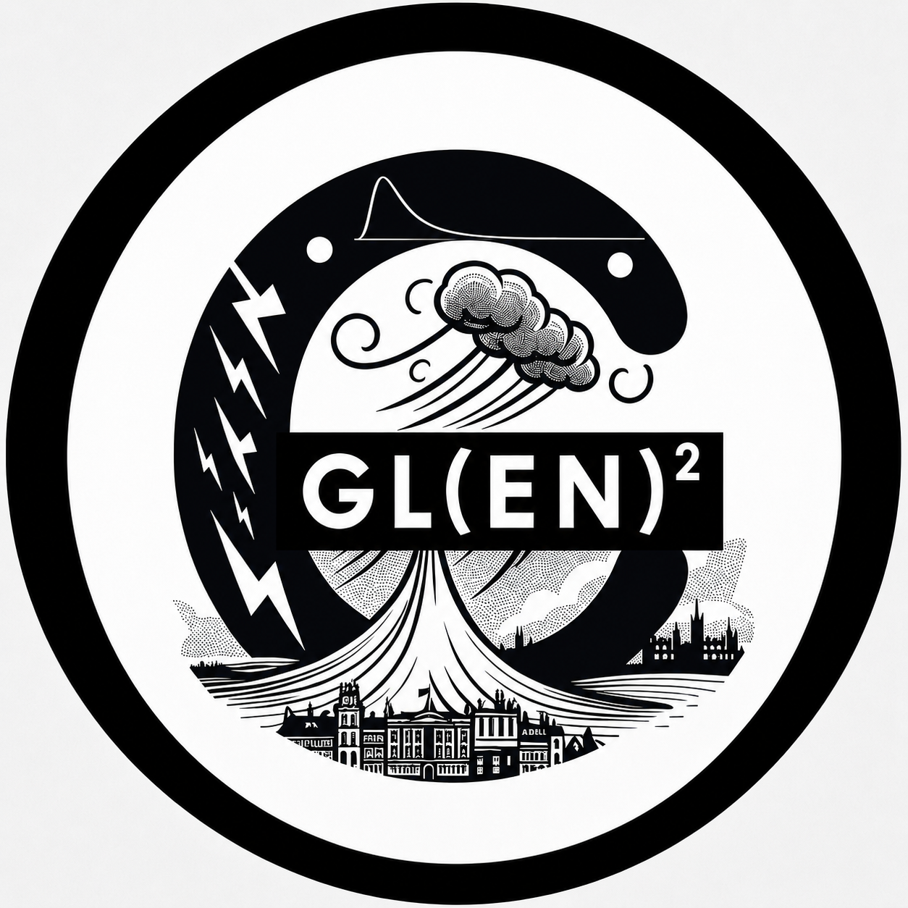
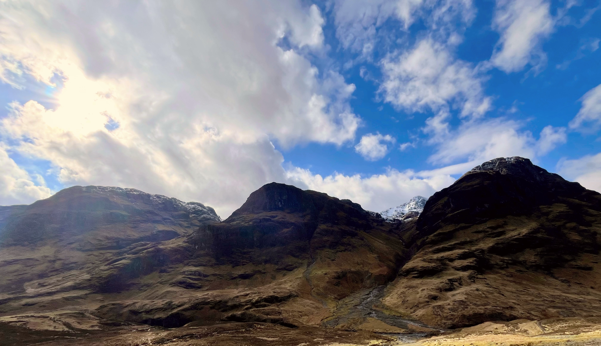
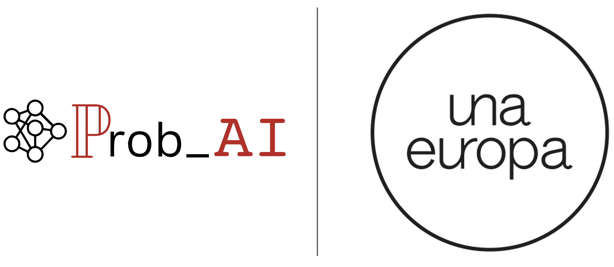

```{r setup, include=FALSE}
knitr::opts_chunk$set(
  message = FALSE, 
  warning = FALSE,
  fig.align = "center"
)
library(knitr)
```


::: {.column-margin}
{width=70%}

## Next meeting

TBC

## Google Group

Subscribe to our [Google Group](https://groups.google.com/u/1/g/gle2n_scotland) to be up-to-date with GL(EN)$^2$ activities.
:::


Welcome to GL(EN)$^2$, formerly GLEN$^2$, which is a Northern UK initiative involving the School of Mathematics & Statistics at the University of Glasgow (UofG), the School of Mathematics at the University of Edinburgh (UofE), the School of Mathematical & Computer Sciences at Heriot-Watt University (HW), the School of Mathematical Sciences at Lancaster University (LU), and the School of Mathematics, Statistics and Physics at Newcastle University (NU).

GLE$^2$N (Glasgow-Edinburgh Extremes Network) was originally conceived as a Scotland-based collaboration, bringing together early-career and established researchers from UofG, UofE, and HW to exchange ideas and explore applied, theoretical, and methodological advancements in statistical risk analysis and extreme value theory (EVT). In July 2026, GLE$^2$N expanded to welcome organisers from LU and NU, with the new initiative rebranded as GL(EN)$^2$, the Glasgow–Lancaster-Edinburgh-Newcastle Extremes Network.

### Objectives
- To enhance collaboration among UK-based researchers interested in EVT.  
- To promote knowledge sharing within the community.  
- To support early-career researchers through networking and collaboration opportunities.  


---

### Meetings
GL(EN)$^2$ meetings are open to all staff and students from the University of Glasgow, the University of Edinburgh, Heriot-Watt University, Lancaster University, and Newcastle University.

From 2026 onwards, our monthly online meetings will be organised into **thematic session series**. Each series will focus on a specific sub-topic over a five-month period, with talks and paper discussions closely coordinated. The aim is to build shared understanding through a small number of connected, in-depth sessions.

Each thematic series will begin with a two-hour foundational lecture introducing the key concepts. Subsequent meetings will follow a consistent format:

1. **Reading group:** A discussion of a recent and relevant paper, led by one of our members.  
2. **Research talk:** A presentation or informal brainstorming session where a member shares ongoing work or new ideas.  

Each meeting includes a 10-minute break between the two parts and is held online via Zoom. We anticipate that the final meeting of each thematic series will be held in person.

You can use [this URL](https://calendar.google.com/calendar/u/1/r?cid=Z2xlMm4uc2NvdGxhbmRAZ21haWwuY29t) to have future GL(EN)$^2$ events automatically added to your calendar.
<!-- ### Google Calendar -->


```{=html}
<iframe src="https://calendar.google.com/calendar/embed?height=700&wkst=2&ctz=Europe%2FLondon&showPrint=0&showTz=0&showTitle=0&hl=en_GB&src=Z2xlMm4uc2NvdGxhbmRAZ21haWwuY29t&color=%23039be5" style="border-width:0" width="740" height="350" frameborder="0" scrolling="no"></iframe>
```

---

### Why GLE$^2$N/GL(EN)$^2$?
Our network's acronym, GL(EN)$^2$, is not only functional but also resonates with the phonetic charm of *glen*, a word of Gaelic origin. Traditionally, glen referred to the narrow valleys found in the rugged landscapes of Scotland and Ireland, but its use has since expanded to describe similar features worldwide.

Many Scottish place names, such as Glen Coe in the northern part of Argyll, trace their roots to the Gaelic word gleann. The beauty of these glens has inspired works by Scotland's national poet, Robert Burns, who wrote about Glenriddell, Glen Afton, and Loch Turret.

<span style="background-color: #d1dce5;">**glen** /ɡlɛn/ *n.* A mountain-valley, usually narrow and forming the course of a stream</span>. *Source: [Oxford English Dictionary](https://doi.org/10.1093/OED/4864668552)*



---

### Funding

Activities of GL(EN)$^2$ are funded by a variety of stakeholders, including the Glasgow Mathematical Journal Trust (GMJT),  Prob_AI, GAIL (Generative AI Lab—University of Edinburgh), and [Una Europa](https://www.una-europa.eu/).


:::{.text-center}
{width=50%}
:::


### Contact

For any inquiries, please contact 

- [Daniela Castro-Camilo](https://www.gla.ac.uk/schools/mathematicsstatistics/staff/danielacastrocamilo/) at daniela.castrocamilo@glasgow.ac.uk.

- [Jordan Richards](https://jbrich95.github.io/) at jordan.richards@ed.ac.uk
