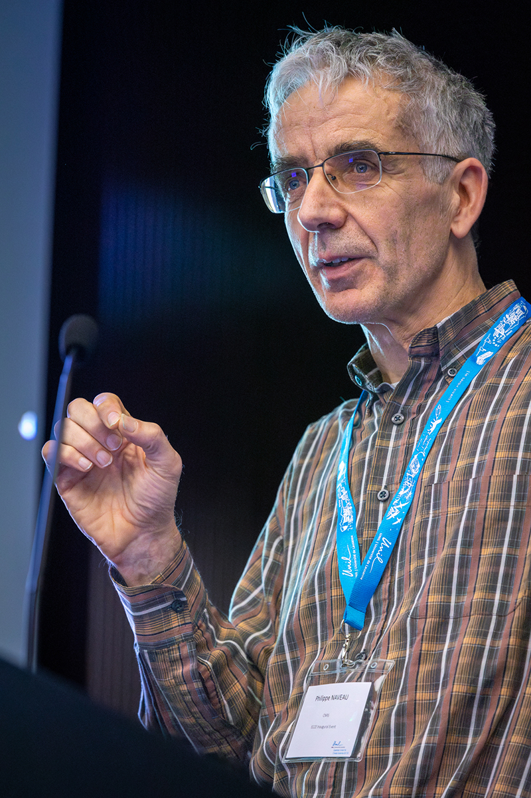

## June 2026

[Philippe Naveau](https://www.lsce.ipsl.fr/en/pisp/philippe-naveau/) (LSCE/IPSL) will be visiting GLE$^2$N to join our final discussion session on the *Causality for Extremes* thematic programme. During the visit, he will give an informal talk on some of his recent work, followed by discussions with members of the network.

Philippe’s work has had a major influence on modern statistical methods for environmental and climate extremes, particularly in spatial modelling and uncertainty quantification.

{style="width:100%; border-radius:10px;"}

